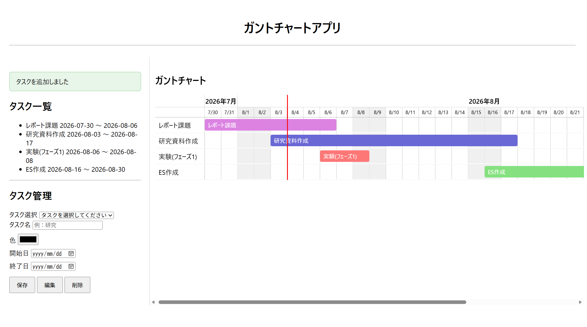

# Gantt Chart App

Flaskで作成した、タスク管理とガントチャート表示ができるWebアプリです。
タスクの登録・編集・削除と、スケジュールのガントチャート表示を
一画面で行えます。
ガントバーをドラッグすることで、タスク期間を直感的に変更できます。

## スクリーンショット



## 主な機能

- タスクの追加
- タスクの編集
- タスクの削除
- 入力内容のバリデーション
- フラッシュメッセージ表示
- 削除前の確認
- ガントチャート表示
- 月・日付ヘッダー表示
- 土日の色分け
- 今日の日付を示す縦線
- 横スクロール
- 今日の位置への自動スクロール
- ガントバーのドラッグ移動
- ドラッグ後の日付を非同期でDBへ保存

## 使用技術

- Python
- Flask
- Flask-SQLAlchemy
- SQLite
- HTML
- CSS
- JavaScript
- Jinja2

## 工夫した点

### 1. ガントチャートをJavaScriptで動的に描画

タスクの開始日・終了日から、バーの位置と長さを計算して表示しています。

1日を40pxとして扱い、開始日との差からバーの位置を算出しています。

また、表示期間に応じて日付・月ヘッダーも動的に生成し、土日の背景色や今日の日付を示す縦線を追加しています。

### 2. JavaScriptの日付処理におけるタイムゾーンへの対応

開発中、今日の日付を示す縦線が日付の境界からずれる問題が発生しました。

原因を調べたところ、`new Date("YYYY-MM-DD")`で生成した日付と、ローカル時間で生成した現在日時で基準となるタイムゾーンが異なっていました。

そこで、日付文字列を年・月・日に分解し、ローカル時間の`Date`オブジェクトを生成する`parseLocalDate()`を作成しました。

これにより、日付計算の基準を統一し、表示位置のずれを解消しました。

### 3. ドラッグ操作とデータベース更新の連携

ガントバーを左右にドラッグすることで、タスクの期間を移動できるようにしました。

ドラッグ量を1日40pxとして日数に変換し、1日単位で位置がスナップするようにしています。

ドラッグ終了後は、新しい開始日・終了日を`fetch()`でFlaskへ送信し、SQLAlchemyを通してSQLiteのデータを更新します。

これにより、ページ全体を再読み込みせずにタスクの日付を変更できるようにしました。


### 4. 操作ミスや更新失敗への対応

タスク削除時には確認ダイアログを表示し、誤操作による削除を防止しています。

また、タスクの追加・編集・削除結果はFlaskのフラッシュメッセージでユーザーに通知します。

ガントバーのドラッグ更新では、サーバーとの通信やデータ更新に失敗した場合に、バーをドラッグ前の位置へ戻す処理を実装しました。

## セットアップ

```bash
git clone <repository-url>
cd gantt-app
python -m venv .venv